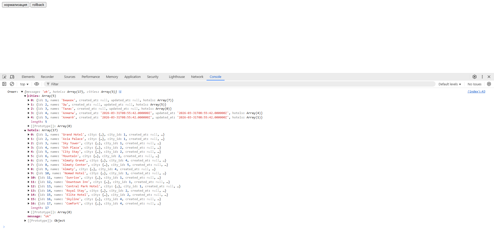
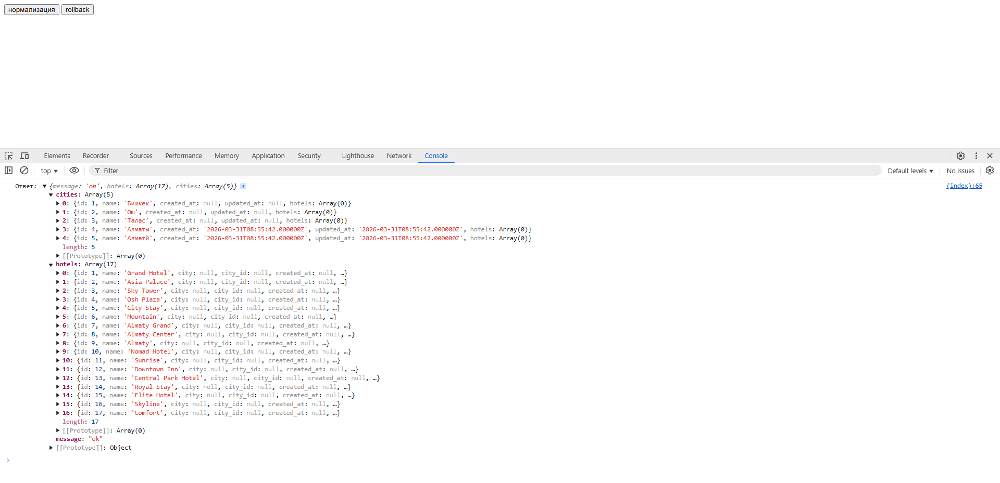

# 🏙️ Hotel City Normalization (Laravel)

Тестовое задание: нормализация городов и привязка отелей к справочнику городов.

---

## 📌 Описание задачи

Проект реализует нормализацию данных городов в таблице `hotels`.

Изначально у каждого отеля город хранится в строковом виде:

```
Бишкек
bishkek
г. Бишкек
Bishkek
```

Задача — привести это к единой справочной таблице `cities` и связать через `city_id`.

---

## 🧱 Структура базы данных

### Таблица `cities`
- `id`
- `name` (например: Бишкек)

### Таблица `hotels`
- `id`
- `name`
- `city` (строка)
- `city_id` (FK → cities.id)

---

## 🔗 Логика маппинга

Для каждого отеля:

1. Нормализуется строка города:
    - `strtolower`
    - `trim`
    - `str_replace('г.', '')`

2. Выполняется поиск в таблице `cities`:
    - сравнение без учета регистра

3. Если город найден:
    - записывается `city_id`

4. Если не найден:
    - создаётся новая запись в `cities`
    - отель связывается с новым `city_id`

---

## ⚙️ Требования

- PHP **8.4**
- PDO SQLite или MySQL (по выбору)
- Laravel 12

---

## 🚀 Установка проекта

### 1. Клонировать репозиторий
```bash
git clone <repo-url>
cd <project-folder>
```

---

### 2. Создать `.env`

```bash
cp .env.example .env
```

---

### 3. Сгенерировать ключ приложения

```bash
php artisan key:generate
```

---

### 4. Выполнить миграции

```bash
php artisan migrate
```

---

### 5. (Опционально) Заполнить тестовые данные

```bash
php artisan db:seed
```

---

### 6. Запустить сервер

```bash
php artisan serve
```

---

## 🌐 Как использовать

После запуска открой:

```
http://127.0.0.1:8000
```

---

## 🧪 Проверка функционала

### ▶️ Нормализация данных

1. Открой главную страницу
2. Нажми кнопку **"Нормализация"**
3. Появится alert об успешном выполнении
4. Результат будет выведен в консоль браузера

---

### ⏪ Rollback (откат)

1. Нажми кнопку **"Rollback"**
2. Связи `city_id` будут очищены
3. Результат отката также появится в консоли браузера

---

## 📊 Ожидаемый результат

После выполнения нормализации:

- у всех отелей заполнен `city_id`
- в таблице `cities` отсутствуют дубликаты
- города приведены к единому виду

---

## 📡 Примеры запросов (если используется API)

### Нормализация
```http
POST /normalize
```

### Rollback
```http
POST /rollback
```

---

## 🧠 Примечание

Проект демонстрирует:
- работу с нормализацией данных
- построение связей между таблицами
- обработку "грязных" данных
- базовую ETL-логику в Laravel

---


## 🧠 Примеры

При нажатии кнопки нормализация

При нажатии кнопки rollback
---
